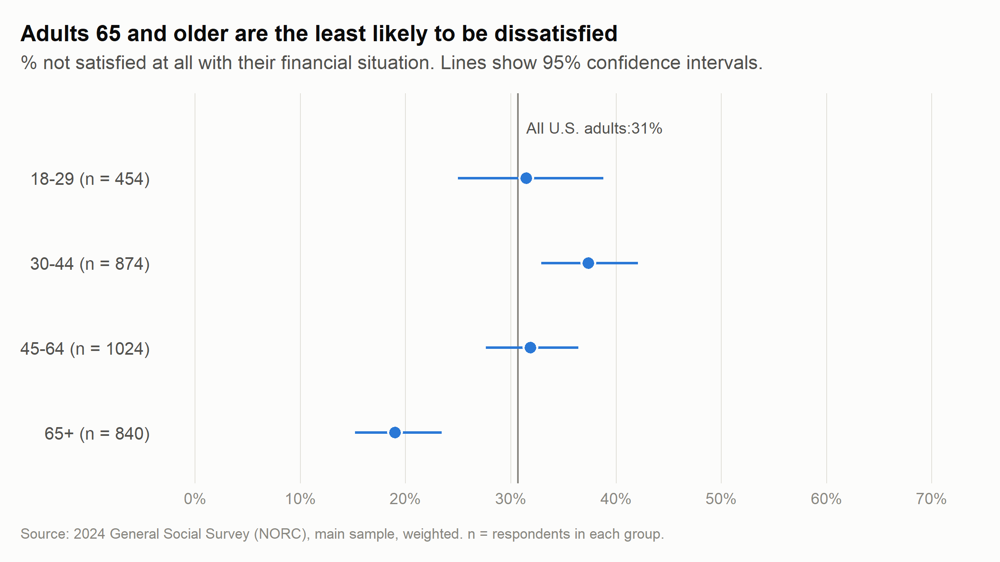
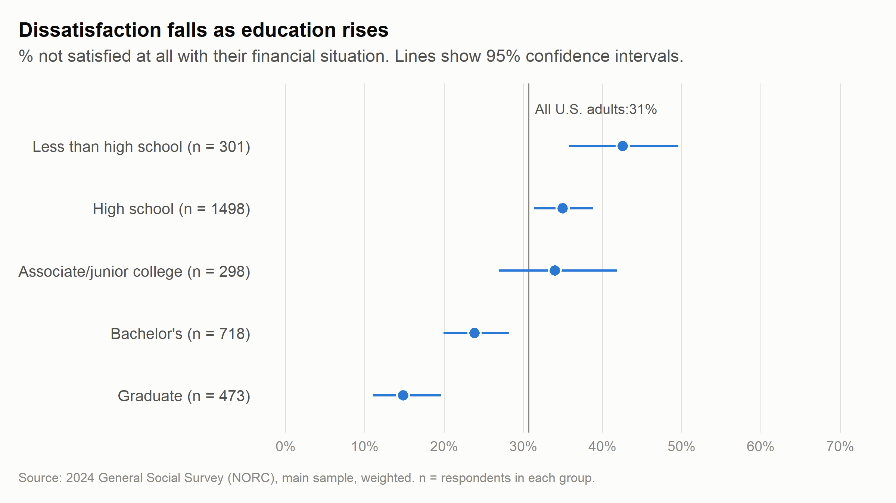
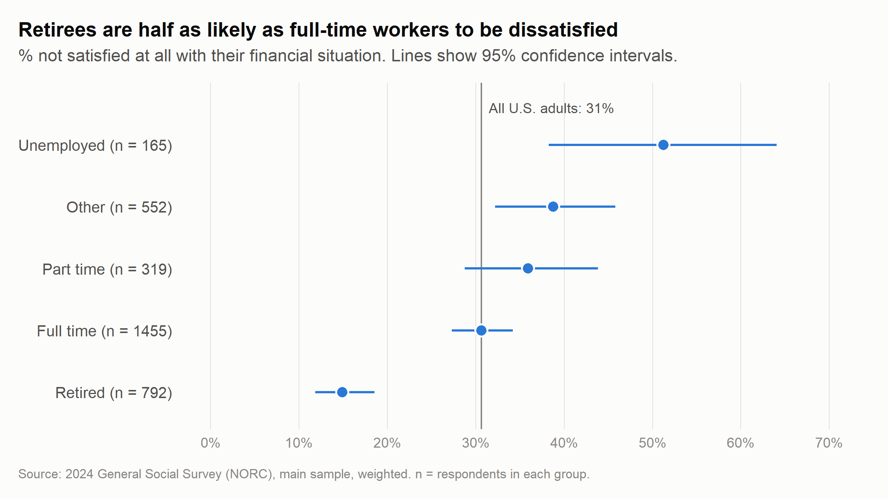
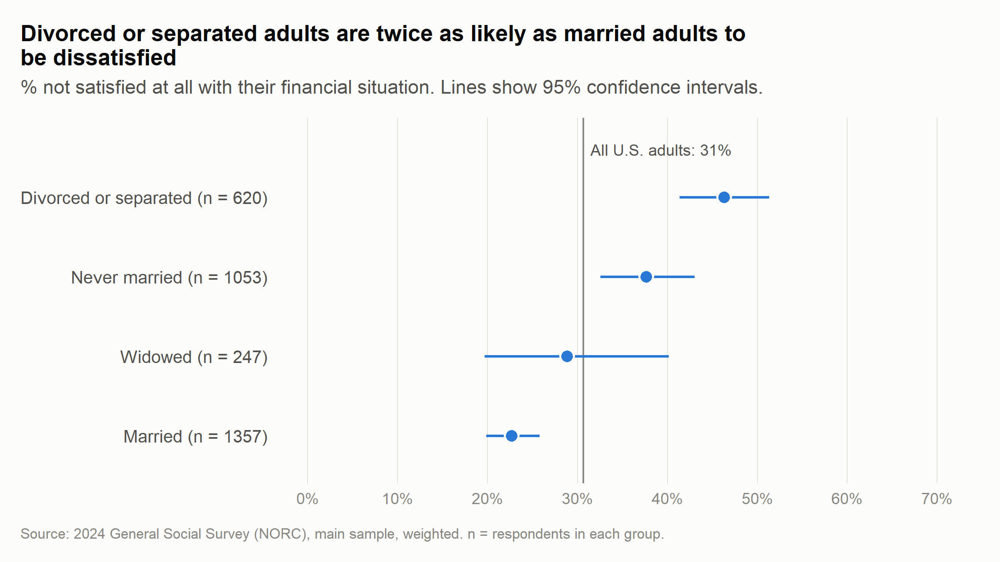
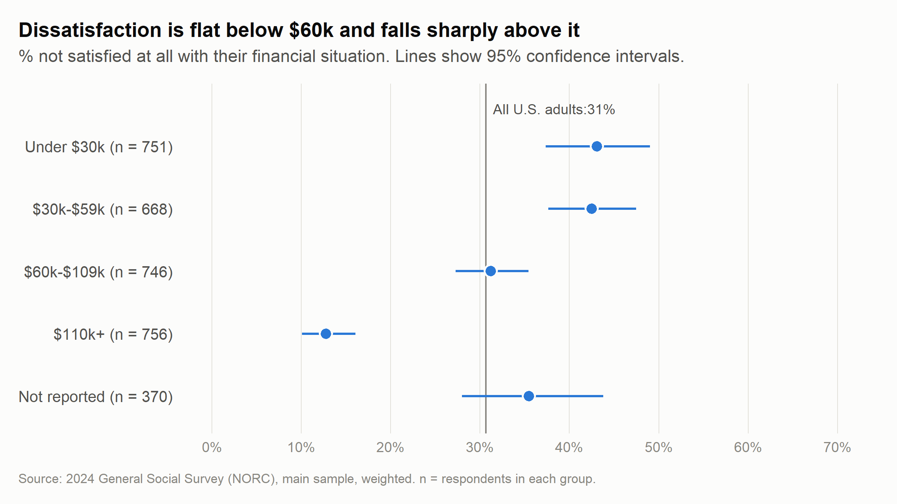

```{r}
#| label: setup

library(dplyr)
library(srvyr)
library(survey)
library(gt)

options(survey.lonely.psu = "adjust")   # same setting as in the R/ scripts

# Results saved by the R/ scripts. The report lives in reports/,
# so every path starts with ../ (one folder up, to the project folder).
design_main <- readRDS("../data/design_main.rds")    # R/03_design.R
table2_gt   <- readRDS("../data/table2_gt.rds")      # R/04_crosstabs.R
model_b     <- readRDS("../data/model_b.rds")        # R/06_model.R
model_tests <- readRDS("../data/model_tests.rds")    # R/06_model.R
table3_gt   <- readRDS("../data/table3_gt.rds")      # R/06_model.R
table1      <- read.csv("../outputs/table1_satfin_estimates.csv", check.names = FALSE)
estimates   <- read.csv("../outputs/estimates_by_group.csv")

# Helpers that turn results into text ------------------------------------------

# A share as a whole percent: 0.307 -> "31%"
whole_pct <- function(x) paste0(round(100 * x), "%")

# A group's share "not satisfied at all": share("income", "$110k+") -> "12.8%"
share <- function(characteristic, group) {
  value <- estimates$pct[estimates$characteristic == characteristic &
                           estimates$group == group]
  sprintf("%.1f%%", value)
}

# An odds ratio from the model with income:
# or_ci("work_statusRetired") -> "OR 0.33, 95% CI 0.22 to 0.50"
or_ci <- function(term) {
  or <- exp(coef(model_b)[[term]])
  ci <- exp(confint(model_b)[term, ])
  sprintf("OR %.2f, 95%% CI %.2f to %.2f", or, ci[[1]], ci[[2]])
}

# A p-value as text: 0.0062 -> "p = 0.006"; 0.00001 -> "p < 0.001"
p_text <- function(p) if (p < 0.001) "p < 0.001" else sprintf("p = %.3f", p)

# Headline numbers, from the saved survey design ---------------------------------
overall <- design_main |>
  filter(!is.na(not_satisfied)) |>
  summarise(pct = survey_mean(not_satisfied, vartype = "ci", proportion = TRUE))

pretty_well <- design_main |>
  filter(!is.na(fin_sat)) |>
  summarise(pct = survey_mean(as.numeric(fin_sat == "Pretty well satisfied"))) |>
  pull(pct)

n_main  <- format(nrow(design_main$variables), big.mark = ",")   # main sample
n_model <- format(nobs(model_b), big.mark = ",")                 # in the model
```

## Executive summary

In 2024, `r whole_pct(overall$pct)` of U.S. adults (95% CI `r whole_pct(overall$pct_low)` to `r whole_pct(overall$pct_upp)`) were not satisfied at all with their financial situation, and only `r whole_pct(pretty_well)` were pretty well satisfied. This report asks which adults were most and least satisfied, and which characteristics are still linked to dissatisfaction once income is taken into account. Age, education, work status and marital status all remained linked to dissatisfaction even among adults with the same income. Three findings stand out.

**1. Income makes the biggest difference at the top.** Adults with family incomes under $30k and $30k-$59k were about equally likely to be not satisfied at all (`r share("income", "Under $30k")` and `r share("income", "$30k-$59k")`), and the share fell to `r share("income", "$110k+")` at $110k or more. At the same age, education, work status and marital status, adults with $110k or more had a quarter of the odds of being not satisfied at all (`r or_ci("income_group$110k+")`).

*Why it matters:* households earning $30k-$59k were as dissatisfied as those earning less, so support aimed only at the lowest incomes would miss a group that is struggling just as much.

**2. Retirees are far less dissatisfied than workers, even at the same income.** Only `r share("work_status", "Retired")` of retirees were not satisfied at all, compared with `r share("work_status", "Full time")` of full-time workers. At the same age, education, marital status and income, retirees had about a third of the odds of full-time workers of being not satisfied at all (`r or_ci("work_statusRetired")`), and their advantage grew, rather than shrank, once income was held constant.

*Why it matters:* financial wellbeing is not only about current income. The retiree result fits the idea that financial security, such as pensions, Social Security and savings, also matters. The GSS doesn't measure these directly, so this is a likely explanation, not a proven one.

**3. Divorced and separated adults are much more likely to be dissatisfied.** Among divorced or separated adults, `r share("marital_status", "Divorced or separated")` were not satisfied at all, twice the share of married adults (`r share("marital_status", "Married")`). At the same age, education, work status and income, they had about 2.3 times the odds of married adults (`r or_ci("marital_statusDivorced or separated")`).

*Why it matters:* support for financial wellbeing could be aimed at life events such as divorce and separation, not only at low income. These results show associations, not causes: divorce can strain finances, but money worries can also contribute to divorce.

*About this analysis:* `r n_main` adults from the main sample of the 2024 General Social Survey, weighted to represent U.S. adults, analyzed with design-based 95% confidence intervals, Rao-Scott tests and weighted logistic regression. See [Limitations](#limitations) for what these results can and can't show.

## Methods

**Data.** The 2024 General Social Survey (GSS) cross-section from NORC at the University of Chicago (Release 3a), a national survey of U.S. adults. The analysis uses the `r n_main` respondents in the main sample. The 677 respondents from NORC's AmeriSpeak oversample are used only in a sensitivity check (see Limitations).

**Outcome.** Respondents were asked whether they were pretty well satisfied, more or less satisfied, or not satisfied at all with their present financial situation (GSS variable SATFIN). The regression models compare "not satisfied at all" with the other two answers.

**Characteristics.** Age (18-29, 30-44, 45-64, 65+), highest degree (five groups), work status (full time, part time, unemployed, retired, and other, which includes people temporarily off work, in school or keeping house), marital status (married, widowed, divorced or separated, never married) and family income (four bands, plus a "Not reported" group for the 1 in 10 respondents who didn't give their income). All five were asked on all three GSS ballots. Full definitions are in the [data dictionary](https://github.com/adeelmanaf43/gss-2024-weighted-analysis/blob/main/data_dictionary.md).

**Weights and survey design.** All estimates use NORC's nonresponse-adjusted weight (WTSSNRPS), which matches the sample to Census population figures, together with the survey's strata (VSTRAT) and clusters (VPSU). Taking the clusters and weights into account makes confidence intervals wider, and more honest, than treating the sample as a simple random sample.

**Analysis.** Weighted percentages with 95% confidence intervals; Rao-Scott chi-square tests, the survey version of the chi-square test, for differences between groups; and weighted logistic regression (svyglm, quasibinomial family) of being not satisfied at all. The model was fitted once without and once with income, on the same `r n_model` respondents who answered every question, and its results are reported as odds ratios with 95% confidence intervals.

**Software.** R `r getRversion()`, with the survey, srvyr, gtsummary and ggplot2 packages; package versions are recorded with renv. All code is on [GitHub](https://github.com/adeelmanaf43/gss-2024-weighted-analysis).

## Results

### Overall satisfaction

Table 1 shows the share of U.S. adults giving each answer. Weighting changed the shares by up to 2.4 percentage points: before weighting, the people who answered were slightly more dissatisfied than U.S. adults as a whole. Including the AmeriSpeak oversample ("all cases") changed every estimate by less than 1 point.

```{r}
#| label: table1
names(table1)[1] <- "Satisfaction with financial situation"
knitr::kable(table1, align = "lccc",
             caption = "Table 1. Satisfaction with financial situation, U.S. adults, 2024: percent (95% CI)")
```

### Differences between groups

Every characteristic was linked to financial satisfaction (Rao-Scott tests, all p < 0.001; Table 2). The charts below show the share not satisfied at all in each group, with 95% confidence intervals; the gray line marks all U.S. adults. Where two groups' intervals don't overlap, the difference between them is clear.

```{r}
#| label: table2
table2_gt
```

::: {.panel-tabset}

#### Age

{fig-alt="Dot chart of the share not satisfied at all by age group, with 95% confidence intervals. Adults 65 and older have the lowest share; the three younger groups overlap."}

Adults aged 65 and older were clearly the least dissatisfied (`r share("age", "65+")`). The three younger groups overlap, so they don't clearly differ from each other.

#### Education

{fig-alt="Dot chart of the share not satisfied at all by highest degree, with 95% confidence intervals. The share falls from less than high school to graduate degree, with the clearest drops at bachelor's and graduate degrees."}

Dissatisfaction fell from `r share("education", "Less than high school")` among adults without a high school diploma to `r share("education", "Graduate")` among those with a graduate degree. The clear drops come with a bachelor's degree and a graduate degree.

#### Work status

{fig-alt="Dot chart of the share not satisfied at all by work status, with 95% confidence intervals. Retirees have the lowest share; unemployed adults have the highest, with a wide interval."}

Retirees (`r share("work_status", "Retired")`) were half as likely as full-time workers (`r share("work_status", "Full time")`) to be not satisfied at all. Unemployed adults had the highest share (`r share("work_status", "Unemployed")`), but it is based on only 165 respondents and is imprecise.

#### Marital status

{fig-alt="Dot chart of the share not satisfied at all by marital status, with 95% confidence intervals. Divorced or separated adults have about twice the share of married adults."}

Divorced or separated adults (`r share("marital_status", "Divorced or separated")`) were twice as likely as married adults (`r share("marital_status", "Married")`) to be not satisfied at all. The estimate for widowed adults is too uncertain to interpret.

#### Family income

{fig-alt="Dot chart of the share not satisfied at all by family income, with 95% confidence intervals. The share is about the same below 60 thousand dollars and falls sharply at 110 thousand dollars and above."}

Dissatisfaction was about the same in the two lowest income bands (`r share("income", "Under $30k")` and `r share("income", "$30k-$59k")`), then fell to `r share("income", "$60k-$109k")` at $60k-$109k and `r share("income", "$110k+")` at $110k or more.

:::

### What remains once income is held constant

Table 3 shows two weighted logistic regression models of being not satisfied at all: one with age, education, work status and marital status, and one that adds family income. Both use the same `r n_model` respondents, so any change between the two columns comes only from holding income constant. An odds ratio (OR) above 1 means higher odds of being not satisfied at all than the reference group (shown with a dash); below 1 means lower odds.

All four characteristics remained linked to dissatisfaction once income was held constant (overall tests: age `r p_text(model_tests[["age"]])`, education `r p_text(model_tests[["education"]])`, work status `r p_text(model_tests[["work_status"]])`, marital status `r p_text(model_tests[["marital_status"]])`). Comparing adults who are the same on everything else in the model:

- **Work status.** Retirees had about a third of the odds of full-time workers (`r or_ci("work_statusRetired")`). Unemployed adults no longer clearly differed from full-time workers (`r or_ci("work_statusUnemployed")`), though this estimate is imprecise.
- **Marital status.** Divorced or separated adults had about 2.3 times the odds of married adults (`r or_ci("marital_statusDivorced or separated")`), and never-married adults about 1.4 times (`r or_ci("marital_statusNever married")`).
- **Education.** Adults with a graduate degree had about half the odds of adults without a high school diploma (`r or_ci("educationGraduate")`). The difference for a bachelor's degree was no longer clear once income was added (`r or_ci("educationBachelor's")`), so much of education's link to satisfaction runs through income.
- **Income.** Adults with $110k or more had a quarter of the odds of those with under $30k (`r or_ci("income_group$110k+")`); the other income bands didn't clearly differ from under $30k.
- **Age.** Adults aged 30-44 had about twice the odds of adults aged 18-29 (`r or_ci("age_group30-44")`). Adults aged 65+, the least dissatisfied age group in the charts, no longer clearly differed (`r or_ci("age_group65+")`): most of them are retired, so the model credits their advantage to retirement rather than age. Because age and retirement overlap so much, this is the most likely reading, not a proven one.

```{r}
#| label: table3
table3_gt
```



## Data citation

Davern, Michael; Bautista, Rene; Freese, Jeremy; Herd, Pamela; and Morgan, Stephen L.; General Social Survey 1972-2024. [Machine-readable data file]. Principal Investigator, Michael Davern; Co-Principal Investigators, Rene Bautista, Jeremy Freese, Pamela Herd, and Stephen L. Morgan. NORC ed. Chicago, 2026. 1 datafile (Release 3a) and 1 codebook (2024 Release 3a).